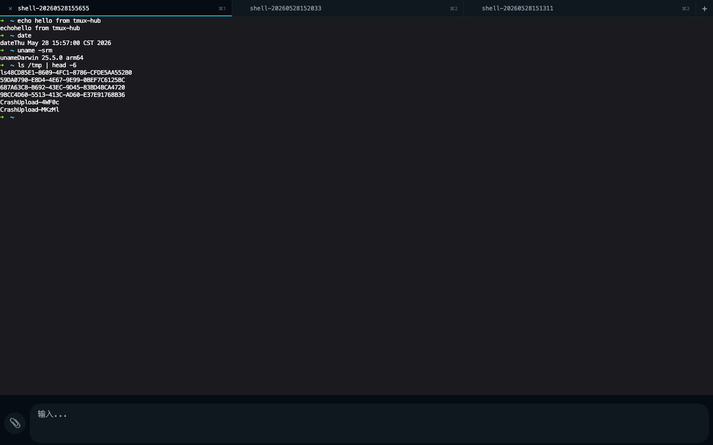
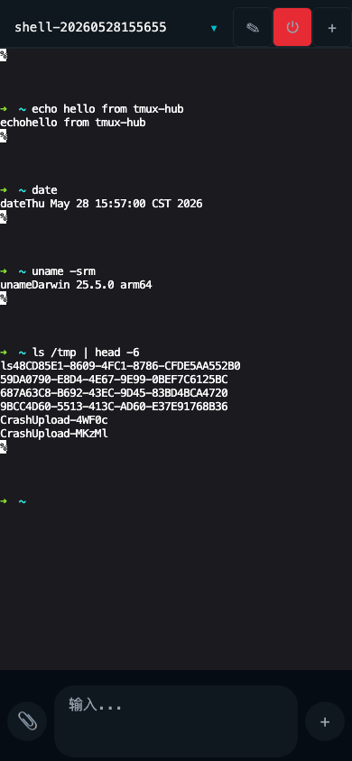
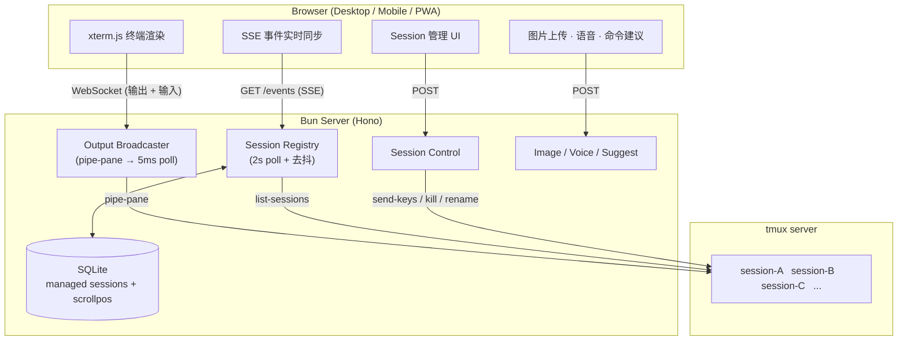

# tmux-hub

**在手机或任意浏览器上实时查看、操作 Mac 上运行的 tmux session——无需 SSH、无需 VPN、不丢历史输出。**

用于解决一个具体问题：Claude Code / Codex 等 CLI AI agent 在 Mac tmux session 里长时间跑任务时，人不在电脑前只能干等。tmux-hub 让你在手机上就能看到实时输出、发送按键、新建或关闭 session，随时掌控进度。

---

## 界面预览

<table>
  <tr>
    <td width="65%"></td>
    <td width="35%"></td>
  </tr>
  <tr>
    <td align="center">桌面端 · 1440 × 900</td>
    <td align="center">移动端 · iPhone 14</td>
  </tr>
</table>

> 截图由 `bun run screenshots:readme` 自动生成（Playwright spawn 临时 demo session → 截图 → kill）。

---

## 产品目标

### 核心功能

| 功能 | 说明 |
|------|------|
| **实时终端输出** | 浏览器内 xterm.js 终端（CanvasAddon GPU 渲染），通过 WebSocket 接收 tmux pane 的实时输出流 |
| **键盘输入** | 移动端：textarea 多行输入 + 特殊键工具栏（Esc / Tab / ^C / 方向键）；桌面端：原生 xterm 键盘直通 + Ctrl/Cmd+T/W/1-9/Tab 标签快捷键 |
| **Agent 状态一览** | 从 pane 动态标题识别 Claude Code / Codex 状态——💬 等待输入、⚡ 正在工作，显示在标签 / session 列表上，一眼看出哪个 agent 在等人 |
| **语音输入** | 移动端 / 桌面 / PWA 🎤 按一下开始、再按一下结束 → 本机 ASR 转写 + LLM 整理 → 插入输入框（人确认后发送），带按用户隔离的历史与音频回放 |
| **命令建议** | 移动端输入自然语言，前台是 shell 时自动翻译成单行命令，review 确认后发送；agent/TUI 前台时不打扰 |
| **Session 管理** | 查看全部 session、切换、重命名、关闭（带确认弹窗）、一键新建（模板 / ad-hoc API / TUI 三入口） |
| **图片上传** | 选择文件上传（桌面端还支持直接粘贴剪贴板图片）→ 服务端落盘 → 把路径注入到当前 pane（给 AI agent 看图用） |
| **断线自愈** | WebSocket 心跳 + 指数退避重连 + 后台冻结恢复 + 滚动位置恢复，iOS Safari / PWA 全覆盖 |
| **PWA 安装** | 支持 Chrome / Edge / Brave 安装到桌面 / Dock，standalone 模式无地址栏，Dock 快捷方式直达新会话 / 会话列表 |
| **终端入口 (TUI)** | `tmux-hub tui` 从任意终端（含 SSH / tmux popup）fzf 选择、创建、attach session |

### 设计原则

- **只读优先**：移动端终端默认只读（read-only），输入通过独立的 textarea 走 send-keys，避免误触
- **不侵入 tmux**：不修改用户的 tmux 配置，只用 `pipe-pane`（输出录制）和 `send-keys`（输入注入）
- **永远在录**：session 被发现的瞬间就开始 pipe-pane 录制，不依赖有没有浏览器连着

---

## 技术实现

> 完整架构（模块地图、数据流、协议、配置全集、测试隔离）见 **[docs/specs/001-architecture.md](docs/specs/001-architecture.md)**。以下是速览。

### 架构总览



### 关键机制

**输出广播（pipe-pane）**：tmux 原生的 `pipe-pane` 把 pane 输出重定向到日志文件，server 以 5ms 间隔轮询文件增量，通过 WebSocket 推给所有连接的浏览器。内存中维护一个 1MB ring buffer；attach 回放可选 server 侧 headless xterm（emulator）快照——按当前宽度正确重排、恢复鼠标 / 光标等终端模式。

**Session 发现（registry poll）**：每 2 秒调用 `tmux list-sessions`，diff 出新增 / 删除 / 变化的 session，通过 SSE 推送给前端，前端不需要轮询。session 归属落 SQLite；删除需连续 3 个 poll 确认（去抖），tmux 探测不确定时绝不清表——防瞬时故障误删。

**输入路由（send-keys）**：浏览器侧按键通过 WebSocket JSON 消息发到 server，server 调用 `tmux send-keys` 注入到对应 pane。每个 session 串行化保证按键顺序；滚轮事件转成终端标准鼠标滚动序列（SGR 1006 编码）后注入；resize 尊重 viewport 所有权——本地有 tmux 客户端 attach 时不抢尺寸。

**心跳与重连**：client 每 15s 发 ping，server 立即回 pong。5s 无 pong 判定断线，指数退避重连（500ms → 30s，最多 8 次），之后进入 dead 状态每 60s 探测。iOS 后台恢复时额外触发一次探测。重连后滚动位置按 client 本地记忆恢复，fresh attach 一律回到底部。

**认证**：三层递进，任一层通过即可：

1. **边缘签名身份**：若部署了 forward-auth 边缘认证服务（作者自建的 gate-auth），由它注入 HMAC 签名的用户身份；
2. **Cloudflare Access**：走 Cloudflare Tunnel 暴露时由 CF Access 在边缘完成登录；
3. **本机 `hub.secret`**：浏览器经 `/system/auth-check` 获取密钥，后续请求带 `X-Hub-Secret` header。

「启动任意命令」（`POST /sessions`）另走独立的 `hub.admin.secret`，详见下文[信任模型](#信任模型)。

### 技术栈

| 层 | 技术 |
|----|------|
| Server runtime | Bun（含 bun:sqlite 持久化） |
| HTTP framework | Hono |
| Web build | Vite + vite-plugin-pwa |
| Terminal rendering | xterm.js (CanvasAddon；server 侧 headless + SerializeAddon 做快照) |
| Config validation | Zod |
| Test | bun:test (unit/integration) + Playwright (E2E) |
| PWA | Workbox precaching + injectManifest |

---

## 部署指南

### 前置条件

- macOS（tmux-hub 设计为跑在你的开发 Mac 上）
- [Bun](https://bun.sh) >= 1.0
- tmux（macOS 自带或 `brew install tmux`）

### 快速开始（本地开发）

```bash
git clone https://github.com/Dandi007/tmux-hub.git
cd tmux-hub
bun install
bun run dev          # http://127.0.0.1:3101
```

### 生产部署

#### 1. 准备配置文件

```bash
mkdir -p ~/.config/tmux-hub

# 环境变量
cp deploy/hub.env.example ~/.config/tmux-hub/hub.env
# 编辑 hub.env，必须设置 TMUX_HUB_REPO_DIR 为仓库绝对路径

# Session 模板
cp deploy/templates.yaml.example ~/.config/tmux-hub/templates.yaml
# 按需编辑 templates.yaml
```

#### 2. 配置说明

`hub.env` 主要变量：

| 变量 | 默认值 | 说明 |
|------|--------|------|
| `TMUX_HUB_REPO_DIR` | **必填** | 仓库绝对路径 |
| `TMUX_HUB_PORT` | 3101 | 监听端口 |
| `TMUX_HUB_HOST` | 127.0.0.1 | 监听地址 |
| `TMUX_HUB_TEMPLATES_PATH` | `~/.config/tmux-hub/templates.yaml` | 模板配置路径 |
| `TMUX_HUB_SECRET_PATH` | `~/.config/tmux-hub/hub.secret` | 认证密钥路径 |
| `TMUX_HUB_LOG_DIR` | `~/.cache/tmux-hub/logs` | pipe-pane 日志目录 |
| `TMUX_HUB_IMAGE_DIR` | `~/Pictures/tmux-hub` | 图片上传目录 |
| `TMUX_HUB_DEV_BIND_SECRET` | 1 | SPA 自动绑定 secret（生产前置 CF Access 时保持 1） |

`templates.yaml` 定义一键新建 session 的模板：

```yaml
templates:
  - id: shell
    name: "新建 zsh"
    cwd_choices: ["~"]
    cmd: "zsh"

  - id: kb-cc
    name: "知识库 cc"
    cwd_choices: ["/path/to/your/knowledge-base"]
    cmd: "zsh -ic 'cc -f; exec zsh -i'"
```

> **注意**：`cmd` 中的 shell function / alias 必须用 `zsh -ic '...'` 包裹，因为 tmux 通过 `/bin/sh -c` 执行命令，不加载 zshrc。

#### 3. 构建 & 启动

```bash
cd /path/to/tmux-hub
bun install
bun run build        # 构建前端到 dist/web/

# 方式 A：直接启动
bun run start

# 方式 B：用 wrapper（带自动重启）
zsh deploy/tmux-hub.zsh
```

wrapper 脚本提供 supervisor 功能：crash 后 2s 重启，连续 5 次快速 crash 则放弃。

#### 4. 外网访问（可选）

tmux-hub 默认监听 127.0.0.1，要从手机访问需要做内网穿透：

- **Cloudflare Tunnel**（推荐）：`cloudflared tunnel --url http://127.0.0.1:3101`，配合 Cloudflare Access 做认证
- **自建反代**：Nginx / Caddy 反向代理到 3101 端口，自行处理 HTTPS 和认证

#### 5. 安装为 PWA

在 Chrome / Edge / Brave 访问部署地址后，地址栏会出现「安装 tmux-hub」按钮。安装后以 standalone 窗口运行，Dock 右键可用「新会话」和「会话列表」快捷入口。

---

> 以下两节（会话启动 API、hub TUI）是参考手册性质的进阶内容；只想部署使用的读者可以跳过。

## 通用会话启动（`POST /sessions`）

用于从脚本、CI 或其他工具中启动**不受模板限制**的 tmux 会话。与模板不同，此端点不限制 cwd 白名单且不绑定 template_id。

### API

```
POST /sessions
Content-Type: application/json
X-Hub-Admin-Secret: <admin-secret>

{
  "cmd": "zsh",           // 必填：在 tmux 中执行的命令
  "cwd": "/path/to/dir",  // 必填：工作目录（必须存在，支持 ~ 展开）
  "name": "my-session",   // 可选：会话名（默认 adhoc-<14位时间戳>）
  "env": {                // 可选：注入到 tmux 的环境变量
    "MY_VAR": "value"
  }
}
```

**响应**：

| code | body | 触发条件 |
|------|------|----------|
| `201` | `{"name": "..."}` | 成功创建 |
| `400` | `{"error": "..."}` | cwd 不存在、name 非法、缺少必填字段 |
| `401` | `{"error": "unauthorized"}` | 缺少 `x-hub-admin-secret` 或值不匹配 |
| `403` | `{"error": "forbidden: not available via tunnel"}` | 请求带有 `cf-access-jwt-assertion` 或 `x-forwarded-for` |
| `409` | `{"error": "session already exists: ..."}` | 同名会话已存在 |

### 信任模型

`POST /sessions` 使用**独立的 admin secret**（`~/.config/tmux-hub/hub.admin.secret`），与浏览器认证使用的 `hub.secret` 不同：

- **`hub.secret`**：通过 `GET /system/auth-check` 分发给浏览器，手机在 CF Access 登录后也会获取到
- **`hub.admin.secret`**：启动时自动生成（0600 权限），**任何 endpoint 都不得返回它**，只有能直接读写本机文件系统的进程才能获取

这样就实现了「仅本机可启动任意命令」的安全边界：手机虽然有 `hub.secret`，但没有 `hub.admin.secret`，无法调用 launch 端点。

### CLI

```bash
bin/tmux-hub launch --cwd /path/to/dir [--name session-name] [--env KEY=VAL]... -- <command...>
```

示例：

```bash
# 启动一个 zsh 会话
bin/tmux-hub launch --cwd ~/projects -- zsh

# 指定会话名和环境变量
bin/tmux-hub launch --cwd /tmp --name my-task --env TASK_ID=42 -- bash -c 'echo $TASK_ID; exec bash'
```

CLI 读取 `~/.config/tmux-hub/hub.admin.secret`（可通过 `TMUX_HUB_ADMIN_SECRET_PATH` 覆盖），向 `127.0.0.1:${TMUX_HUB_PORT:-3101}/sessions` 发送 POST 请求。成功时打印会话名到 stdout，失败时输出错误到 stderr 并以非零值退出。

### 日志保留

- **模板会话**：退出后日志被删除（与原有行为一致）
- **ad-hoc 会话**（通过 `POST /sessions` 创建）：退出后日志保留在 `~/.cache/tmux-hub/logs/<name>.log`
- 服务端通过内存 `retainLog` 集合跟踪 ad-hoc 会话，启动时从数据库重建

---

## Terminal entry (hub TUI)

交互式终端菜单，用于快速选择、切换或创建 tmux 会话。支持从任意终端（包括 SSH）直接使用，也可嵌入 tmux popup。

### 使用方式

```bash
# 交互模式：显示菜单，选择后 attach/switch
tmux-hub tui

# 非交互模式：列出所有会话和模板（JSON 格式）
tmux-hub tui --list

# 非交互模式：直接 attach 到指定会话
tmux-hub tui --select my-session

# 非交互模式：通过模板创建新会话并 attach
tmux-hub tui --select-template shell

# 打印将要执行的命令（不实际执行）
tmux-hub tui --select my-session --print-cmd

# 循环模式：detach 后自动返回菜单（适合 SSH RemoteCommand）
tmux-hub tui --loop
```

### SSH 配置示例

在 `~/.ssh/config` 中配置，SSH 登录后自动进入 TUI：

```
Host my-mac
  HostName 192.168.1.100
  User yourname
  RemoteCommand tmux-hub tui --loop
  RequestTTY yes
```

### tmux popup 集成

在 `~/.tmux.conf` 中添加快捷键，从 tmux 内部呼出 TUI popup：

```bash
bind-key T display-popup -E -w 80% -h 70% "tmux-hub tui"
```

按 `prefix + T` 即可呼出菜单，选择后自动 switch-client 到目标会话。

### 嵌套行为

TUI 会根据 `$TMUX` 环境变量自动选择正确的命令：

- **在 tmux 外部**（普通终端或 SSH）：使用 `tmux attach-session -t <name>`
- **在 tmux 内部**（popup 或嵌套调用）：使用 `tmux switch-client -t <name>`

这样可以避免 "sessions should be nested with care" 错误。

### 菜单内容

TUI 菜单按以下顺序显示：

1. **活跃会话**：按最近活动时间排序，已 attach 的会话标记 `●`
2. **模板**：从 `GET /templates` 获取，显示模板名称和 ID
3. **新建 shell**：固定选项，创建一个新的 zsh 会话

如果 server 不可达，模板部分会降级（仅显示会话），不会崩溃。

### 选择器

- **fzf 可用时**：使用 fzf 进行模糊搜索和选择，支持预览窗口
- **fzf 不可用时**：回退到数字菜单（打印编号列表，输入数字选择）

选择器逻辑已抽成纯函数，便于单元测试。

---

## 测试

```bash
bun test                    # unit + integration（70+ 测试文件）
bun run test:e2e            # Playwright E2E（desktop / mobile / PWA / key-conformance / suggest）
```

详细的测试规范和开发流程见 [AGENTS.md](AGENTS.md)。

架构文档见 [`docs/specs/001-architecture.md`](docs/specs/001-architecture.md)；历史设计 spec 与实现计划见 [`docs/superpowers/`](docs/superpowers/)。
