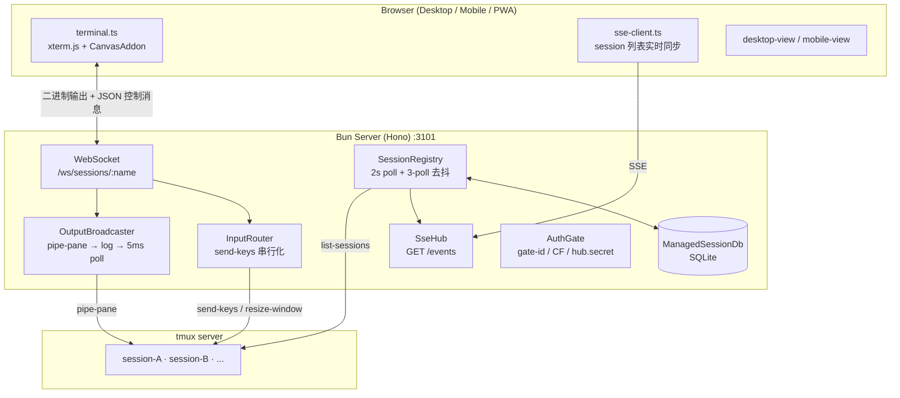

# tmux-hub 架构文档

> 本文描述 tmux-hub 的当前架构（截至 2026-07，main @ d0cb3b9）。面向要读懂或修改代码的人。
> 产品定位、部署与使用方式见 [README.md](../README.md)；开发流程与测试规范见 [AGENTS.md](../AGENTS.md)。

---

## 1 总览

tmux-hub 是一个跑在开发机（macOS）本地的 Bun server，把本机 tmux server 里的 session 桥接到浏览器：输出经 `pipe-pane` 录制后走 WebSocket 推流，输入经 `send-keys` 注入，session 列表变化经 SSE 广播。前端是 Vite 构建的 SPA（desktop / mobile 双视图 + PWA）。



两条传输通道分工明确：

| 通道 | 端点 | 方向 | 内容 |
|------|------|------|------|
| **WebSocket** | `/ws/sessions/:name` | 双向 | 终端输出（二进制 verbatim）+ 输入/心跳/滚动位置等 JSON 控制消息 |
| **SSE** | `GET /events` | server→client | session 列表事件（snapshot / created / removed / activity / server_down / server_up / replay_truncated） |

---

## 2 目录结构

```
src/
├── server/            # Hono HTTP + WS 服务端（Bun 运行时）
│   ├── main.ts            # 启动流程、路由注册、WS upgrade
│   ├── output-broadcaster.ts  # pipe-pane 录制 → 轮询 → 广播 → replay
│   ├── ring-buffer.ts     # 1MB 循环缓冲
│   ├── input-router.ts    # keys/key/wheel/resize 路由 + 单 session 串行化
│   ├── session-registry.ts    # 2s poll + diff + 去抖删除
│   ├── managed-db.ts      # SQLite：managed_sessions + scroll_positions
│   ├── session-control.ts # kill/rename/detach/refresh/start-tmux-server
│   ├── template-runner.ts # templates.yaml → new-session
│   ├── session-emulator.ts / mode-shadow.ts  # server 侧 headless xterm snapshot
│   ├── viewport-pinner.ts # web/native viewport 所有权
│   ├── auth.ts / identity.ts / cf-access.ts / admin-gate.ts / secret.ts  # 认证
│   ├── voice-routes.ts / voice-store.ts / voice/   # 语音链路
│   ├── suggest-routes.ts / suggest/               # NL→命令建议链路
│   ├── image-upload.ts    # 图片上传
│   ├── hub-tui.ts / cli.ts    # 终端入口（tui / launch）
│   └── config.ts          # 全部 env 配置解析
├── shared/            # 前后端共享：protocol.ts（DTO）、key-map、session-name、scroll-restore
└── web/
    ├── main.ts            # 按 max-width:720px / pointer:coarse 分派 desktop|mobile
    ├── terminal.ts        # xterm 封装：WS 连接、心跳重连、本地预测 echo、滚动恢复
    ├── sse-client.ts      # /events 订阅
    ├── momentum-scroll.ts / viewport-owner.ts / visibility-recovery.ts
    ├── desktop/           # tab-bar、terminal-pool、session-list、快捷键
    ├── mobile/            # session-picker、special-keys-bar、voice-*、suggest-*、image-attach、wake-lock
    ├── pwa/               # sw 注册、install prompt、Dock shortcuts
    ├── shared/            # cc-status、quick-launch、template-picker、rename/kill controller、ime-guard、last-session
    ├── ui/                # toast、confirm-modal、connection-status、context-menu
    └── sw.ts              # Workbox service worker
```

---

## 3 输出链路（tmux → 浏览器）

核心原则：**永远在录**。session 一旦被 registry 发现，就建立 `pipe-pane` 录制，不依赖是否有浏览器连着。

1. **录制**：`tmux pipe-pane -t <session>:0.0 'cat >> <log>'`（`output-broadcaster.ts`）。sink 命令经 `PIPE_SINK_CMD` 可配，Linux 上优先 busybox cat 避免行缓冲。
2. **轮询**：broadcaster 以 **5ms** 间隔读日志文件增量，写入 ring buffer（默认 **1MB**，`ring-buffer.ts`）并广播给所有 WS 订阅者；若启用 emulator，同步 `writeSync` 进 headless xterm。
3. **attach replay**：新连接先注册 tap、再取 snapshot、最后 flush pending，保证字节序无空洞（`attachWithReplay`）。snapshot 两种模式：
   - **emulator 模式**（`TMUX_HUB_EMULATOR=1`）：server 侧 headless xterm + SerializeAddon 序列化当前屏幕 + 1000 行 scrollback，再追加 `ModeShadow.serializeModes()` 恢复 capture-pane 丢失的 DEC modes（鼠标编码、光标可见性、scroll region）。
   - **传统模式**：RIS（`\x1bc`）+ ring buffer 尾部字节，上限 `REPLAY_CAP_BYTES`（默认 256KB，防移动端解析器 OOM）；被截断时经 SSE 发 `replay_truncated`。
4. **推送**：输出以二进制帧直接 `ws.send()`，前端 `terminal.ts` 收到 binary 直接 `term.write()`，收到 string 则按 JSON 控制消息解析。

## 4 输入链路（浏览器 → tmux）

`input-router.ts` 按 session 维护 promise 锁做**串行化**（保证按键顺序），resize 独立不入队（防 native resize 竞态阻塞）：

| WS 消息 | 处理 |
|---------|------|
| `{kind:"keys", literal}` | 按 1024B 分块 → `tmux send-keys -l` |
| `{kind:"key", name}` | allowlist 校验（Enter/Escape/C-c/方向键等）→ `tmux send-keys <name>` |
| `{kind:"wheel", ...}` | SGR(1006) 鼠标编码（`mouse-encode.ts`，每 notch 一条，上限 20）→ `send-keys -l` |
| `{kind:"resize", cols, rows}` | 仅当 web 拥有 viewport 时 `resize-window`；有 native client 则跳过并回报实际尺寸 |
| `{kind:"ping"}` / `{kind:"scrollpos"}` / `{kind:"telemetry"}` | 心跳回 pong / 滚动位置落库 / 性能数据记日志 |

**viewport 所有权**（`viewport-pinner.ts` + `web/viewport-owner.ts`）：连接建立时查 `#{session_attached}`——无本地 attach 客户端则 web pin viewport（`window-size manual` + `resize-window`）；有则 native 拥有，web 端抑制本地 resize、采用 server 下发尺寸。native 全部 detach 后 web 收回所有权。

## 5 Session 生命周期

- **发现**：`session-registry.ts` 每 **2s** `tmux list-sessions`，diff 后经 SSE 推 `session_created/removed/activity`。前端零轮询。
- **删除去抖（#90/#92 事故根治）**：managed session 在 tmux 消失需连续 **3 个 poll** 确认才从 DB 删除并广播 removed；`list-sessions` 返回 "no server running" 判为**探测不确定**（serverReachable=false），跳过一切 prune，防 managed 表整表误清。反向 self-heal：tmux 里活着但 DB 缺记录则自动补回。
- **持久化**：`managed-db.ts`（SQLite WAL，`~/.cache/tmux-hub/managed-sessions.db`）存两张表：`managed_sessions(name, created_at, template_id)`（template_id NULL = ad-hoc）与 `scroll_positions`。
- **创建**：三个入口——`POST /templates/:id/run`（浏览器，cwd 白名单）、`POST /sessions`（仅本机 admin secret，任意 cmd/cwd/env）、TUI/快捷方式（复用 templates）。
- **销毁**：`session_removed` 时停 broadcaster；template session 日志删除（move 到 `.trash`，不直接 unlink），ad-hoc session 日志保留（`retainLog` 集合，启动时从 DB `adhocNames()` 重建）。

## 6 认证与信任模型

`auth.ts` 对写路径强制认证，按优先级尝试三层，得到的 identity 标签用于语音等按用户隔离的功能：

1. **gate-id**（`identity.ts`）：边缘 forward_auth（gate-auth）注入 `X-Auth-User-Id` + `X-Auth-Sig`，HMAC-SHA256(`uid|app|ts`) 校验，±300s 时间容忍；`GATE_INJECT_KEY` 为空则跳过。
2. **Cloudflare Access JWT**（`cf-access.ts`）：当前为 stub（恒 null），边缘认证实际由 CF Access 在 tunnel 层完成。
3. **本机 hub.secret**（`secret.ts`）：`X-Hub-Secret` 与 `~/.config/tmux-hub/hub.secret` timing-safe 比较；浏览器经 `GET /system/auth-check` 获取后缓存。

**admin 边界**（`admin-gate.ts`）：`POST /sessions`（任意命令启动）单独走 `hub.admin.secret`（0600，任何 endpoint 不返回），且显式拒绝带 `cf-access-jwt-assertion` / `x-forwarded-for` 的 tunneled 请求——手机有 hub.secret 也无法启动任意命令，只有能读本机文件系统的进程可以。

## 7 前端架构

### 7.1 终端（terminal.ts）

- **渲染**：xterm.js + CanvasAddon（延迟 50ms 加载，失败降级 DOM 渲染）；拦截 DECSCUSR 防 TUI 改坏光标样式。
- **心跳/重连**：15s ping、5s 无 pong 判断线；指数退避 + jitter（500ms→30s，最多 8 次），之后 dead 态每 60s 探测；出站消息断线时排队（上限 65KB）重连后 flush。
- **本地预测 echo**：printable 字符本地即时回显掩盖网络延迟；检测到 cursor-positioning CSI 或 alternate buffer（TUI 应用）即禁用，预测缓冲 2s 过期。

### 7.2 滚动体系（#87/#88/#91/#93 最终态）

四个模块协作，核心不变量是 **client 本地 linesFromBottom (lfb) 是唯一真值**（server DB 值 v2 起不参与恢复决策）：

- `momentum-scroll.ts`：touch 拖动 + 惯性 fling（velocity EMA、行高量化、外部 actor 改动 viewport 即取消）；alt-screen TUI 下 drag 转 wheel ticks 转发给应用。
- `shared/scroll-restore.ts`：纯函数决策——fresh attach 一律钉底；reconnect 恢复本地快照 lfb，clamp 到 buffer 可滚范围，lfb==0 强制回底。
- `terminal.ts` 集成：1s 轮询上报 scrollpos（仅 terminal 真实可见时，防 desktop pool 中 hidden slot 污染）；hidden slot attach 时决策挂起（pendingDecision），可见后执行。
- `visibility-recovery.ts`：后台 >3s 返回前台触发 reconnect + probe（iOS Safari/PWA 冻结自愈），bfcache pageshow 无条件触发。

### 7.3 Desktop / Mobile 视图

- **desktop**：`tab-bar`（session 标签 + cc-status 图标 + 右键菜单）+ `terminal-pool`（每 session 一个 slot，仅一个 active，其余保持连接便于秒切）；快捷键 Ctrl/Cmd+T 新建、+W 关闭、+1-9 直达、+Tab/+Shift+Tab 循环。
- **mobile**：只读终端 + 独立输入 pill（📎 图片、textarea、🎤 语音、↑ 发送）+ special-keys-bar（Esc/Tab/^C/方向键）；session 切换走串行化状态机防竞态；wake-lock 保活；ime-guard 防中文输入法 compositionend 后的 phantom Enter。
- **cc-status**（`web/shared/cc-status.ts`）：从 pane_title（OSC 动态标题）识别 Claude Code / Codex agent 状态——✳ 为 idle（💬 待输入）、Braille spinner 为 working（⚡），显示在 tab / picker 上，一眼看出哪个 agent 在等人。

### 7.4 PWA

Workbox precache（app shell 缓存 + 后台 revalidate、navigation 网络优先 + offline 降级、3xx 不缓存防 CF Access OAuth 回环）；SW 每 60s update 检测、有新版本自动 skipWaiting + reload（解决 PWA 常驻不刷新）；Dock/桌面 shortcuts（新会话 / 会话列表）经 `?action=` URL 参数实现。

## 8 语音链路（mobile 🎤）

```
MediaRecorder(audio/mp4|webm) → POST /api/voice (X-Hub-Secret + identity)
  → voice-intake(:8099) /transcribe?card=hub-polish   # 编排 ASR(:8095) + 整理
  → SSE 事件流原样透传回前端（uploaded→transcribing→cleaning→done）
  → server 旁路拦截 done 事件 → voice.db 落库（uid, text, audio_blob_id）
```

转写结果**插入 textarea 不自动发送**（人确认后再发）。历史回看 `GET /api/voice/history`（按 identity 隔离），音频回放经 `GET /api/voice/audio/:id` 代理 mp-blob(:8097)，带 blob 归属校验防越权。整条链路 loopback-only，`TMUX_HUB_VOICE=1` 开关。

## 9 Suggest 链路（NL → shell 命令）

移动端打字场景的自然语言转命令（`TMUX_HUB_SUGGEST=1` 开关）：

1. 前端 4s 轮询 `GET /sessions/:name/pane-mode`——前台进程是 shell（zsh/bash/fish/sh）才启用；agent/TUI 前台时输入直接字面发送。
2. Enter 触发 `POST /sessions/:name/suggest`：server 取 cwd + 最近 40 行 pane 输出 +（可选）zsh history 高频命令（秘钥正则过滤）构造 prompt，经 cc-switch 网关（:15721）调 LLM，6s 超时。
3. 前端三态状态机 draft→loading→review：返回的命令进入 review 态，人**确认后才发送**，可撤销回原文。失败/超时降级为字面发送，不阻塞输入。

## 10 终端入口（hub TUI + launch CLI）

`bin/tmux-hub` 提供两个子命令（详细用法见 README）：

- `tui`：fzf（降级数字菜单）选择 session/template，attach 或 switch-client（按 `$TMUX` 自动选择防嵌套报错）；`--loop` 适配 SSH RemoteCommand；server 不可达时降级只列 session。
- `launch`：读本机 `hub.admin.secret` 调 `POST /sessions`，供脚本/CI 启动任意命令的受管 session。

## 11 配置

全部配置经 env 解析于 `config.ts`，按域分组（完整默认值见该文件）：

| 域 | 关键变量 |
|----|----------|
| 网络 | `TMUX_HUB_PORT`(3101) · `TMUX_HUB_HOST`(127.0.0.1) · `TMUX_HUB_SOCKET`（tmux -L，测试隔离用） |
| 输出/缓冲 | `RING_BUFFER_BYTES`(1MB) · `REPLAY_CAP_BYTES`(256KB) · `EMULATOR`(=1 启用) · `SNAPSHOT_SCROLLBACK_LINES`(1000) · `PIPE_SINK` |
| session | `TEMPLATES_PATH` · `REGISTRY_INTERVAL_MS`(2000) · `COLS/ROWS`(200×50) · `DB_PATH` |
| 认证 | `SECRET_PATH` · `ADMIN_SECRET_PATH` · `GATE_INJECT_KEY` · `TMUX_HUB_GATE_APP` |
| 语音 | `VOICE`(=1) · `INTAKE_BASE`(:8099) · `ASR_BASE`(:8095) · `BLOB_BASE`(:8097) · `VOICE_DB_PATH` |
| suggest | `SUGGEST`(=1) · `SUGGEST_ENDPOINT`(:15721) · `SUGGEST_MODEL` · `SUGGEST_PROTOCOL`(chat\|responses) · `SUGGEST_HISTORY` |
| 上传/日志 | `IMAGE_DIR` · `MAX_IMAGE_BYTES`(20MB) · `LOG_DIR` · `LOG_LEVEL` |

（表中变量除注明者外均带 `TMUX_HUB_` 前缀。）

## 12 测试与隔离

- **unit**（~40 文件）+ **integration**（~24 文件）走 `bun test`，**E2E** 走 Playwright（desktop/mobile/PWA/key-conformance/suggest）。
- **生产状态强隔离（#90 事故后固化）**：`tests/helpers/lint-no-prod-state.ts` 静态检查禁止测试裸建 `new ManagedSessionDb()`（会打开生产 DB），必须显式 temp 路径；`lint-no-default-socket.ts` 同理强制测试用独立 tmux socket（`-L`），杜绝测试触碰生产 tmux server 与 DB。
- 部署形态为双实例金丝雀：**dogfood 跟 main 头，prod 手动 promote 已验证 commit**（见 CLAUDE.md）。

# References

- 源码：`src/server/`、`src/web/`、`src/shared/`（main @ d0cb3b9，2026-07）
- 历史设计决策：`docs/superpowers/specs/`（per-MR spec）
- 事故根治背景：PR #88/#90/#91/#92/#93（滚动真值收敛、registry 去抖、测试隔离）
